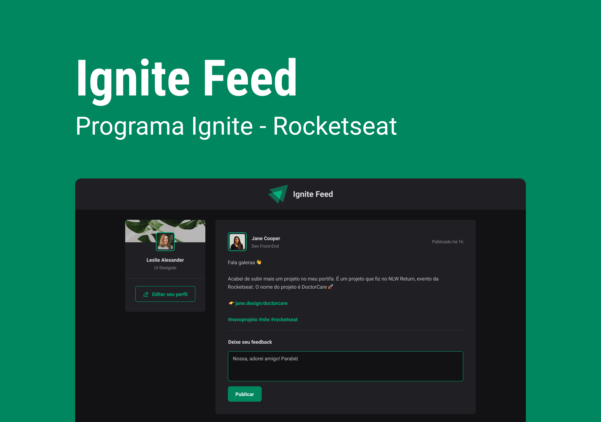

  

## 💻 Sobre

Uma aplicação que simula um feed de rede social no estilo do Instagram, desenvolvida durante as aulas de Fundamentos com React da Rocketseat.

___

## 🚀 Tecnologias

Este projeto foi desenvolvido com as seguintes tecnologias:

- [React](https://react.dev/)
- [TypeScript](https://www.typescriptlang.org/)
- [Vite](https://vitejs.dev/)
- [Phosphor Icons](https://phosphoricons.com/)

___

## 🎨 Layout

___

Made with ❤️ by Bruno Henrique de Godoy 👋🏽 [Get in Touch!](https://www.linkedin.com/in/bruno-godoy-07806726b/)
